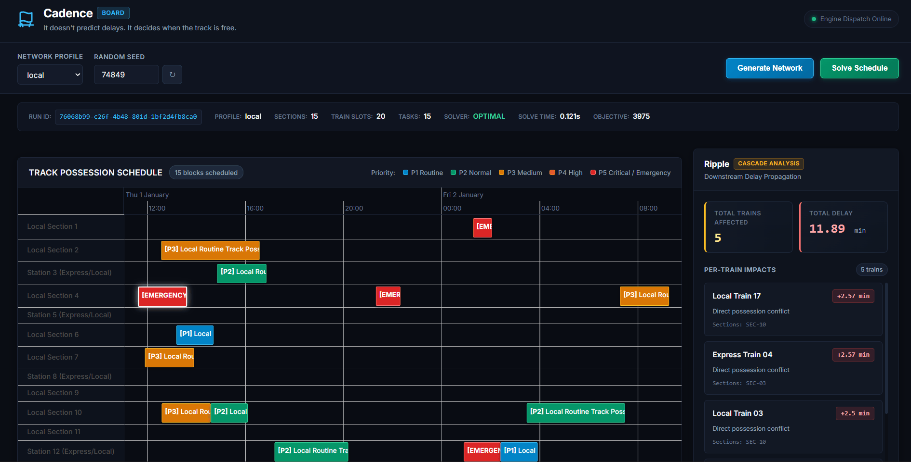
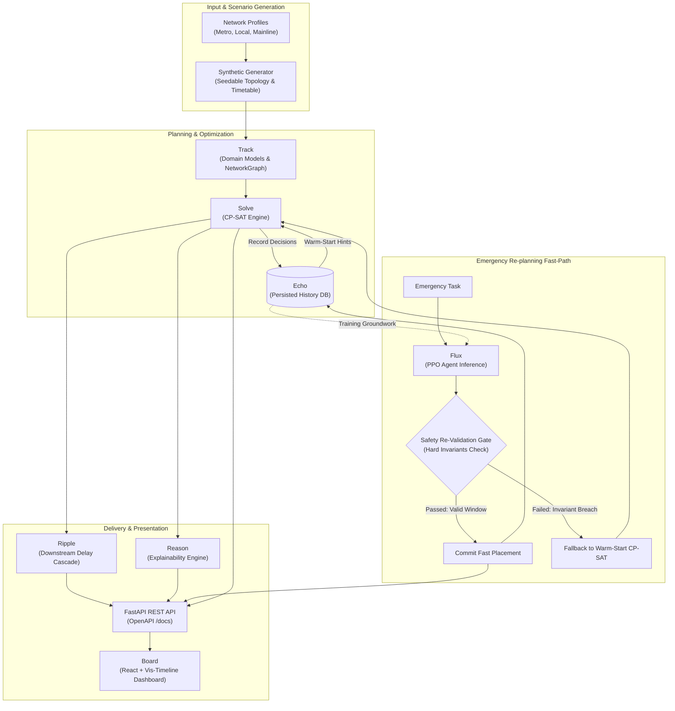

# Cadence

> *It doesn't predict delays. It decides when the track is free.*

[](https://github.com/jeevapriyan10/cadence/actions/workflows/ci.yml)
[](LICENSE)
[](https://www.python.org/)
[](https://nodejs.org/)
[](file:///e:/big/cadence/backend/pytest.ini)

<!-- Demo Recording / Screenshot Placeholder -->


---

## What It Is

Cadence is a constraint-optimization (CP-SAT) and reinforcement-learning (PPO) engine that plans and dynamically re-plans railway maintenance block windows, adaptable to metro, suburban/local, and mainline networks through typed network profiles. It models rail infrastructure as directed graphs, enforces strict physical non-overlap and topological safety-adjacency invariants, and balances maintenance possession productivity against passenger and freight train service disruption.

---

## Why Two Engines

1. **Exact CP-SAT for Planned Solves**: Scheduled railway possessions demand mathematical rigor. Soft heuristics and unverified search algorithms risk violating track possession boundaries or interlocking clearances. Cadence uses Google OR-Tools CP-SAT to explore the combinatorial space, proving feasibility and guaranteeing optimal schedule placement under hard safety constraints.
2. **Learned Fast-Path (Flux) for Real-Time Emergencies**: When an emergency track fault occurs, dispatchers cannot wait minutes for a fresh combinatorial solver run. Cadence provides **Flux**, an RL agent (PPO) that evaluates scenario observations and selects candidate placement slots in sub-2ms wall time (~20x–39x faster than full resolve).
3. **The Safety Trust Boundary**: In Cadence, reinforcement learning is treated strictly as an **untrusted proposal heuristic**. Every action proposed by Flux must pass through an independent, deterministic **Hard-Constraint Re-Validation Gate**. If an RL-suggested slot causes a same-section conflict or breaches profile safety-adjacency rules, it is rejected immediately, and Cadence automatically falls back to warm-start CP-SAT. The neural network never has the authority to commit an unsafe schedule.

---

## Scope & Limitations

Cadence is an algorithmic engineering artifact built with an honest-data stance. The system operates under the following explicit constraints and simplifications:

- **Synthetic Data Only**: No real railway infrastructure, timetable, or signalling interlocking data is used or claimed to be validated against. Real block-section geometry, headway telemetry, and possession regimes are safety-critical proprietary assets and not publicly accessible. All topologies, train slots, and tasks are procedurally generated by a seedable generator, ensuring 100% reproducible test scenarios from `(profile, seed)`.
- **Simplified Profile Abstractions**: The built-in profiles (`MetroProfile`, `LocalProfile`, `MainlineProfile`) are structural approximations of real-world operating models, not certified railway rule books. Real railway safety regimes (e.g., UK RSSB standards, US GCOR, Indian Railways General Rules, wayside interlocking routes, temporary speed restrictions) involve multi-aspect signalling logic vastly more intricate than the topological safety-adjacency invariants modeled here.
- **Ripple Cascade Simplifications**: Downstream delay propagation in Ripple assumes uniform train travel time across route sections. Delay propagation is calculated as a **single-hop cascade** rather than an $N$-hop iterative reaction chain across subsequent conflicting train runs.
- **Flux Scope**: The RL environment (`CadenceReplanEnv`) models **single-decision episodes** (one emergency arrival requiring one placement) over a discretized candidate-slot action space. Models are trained on synthetic scenarios and are never trusted without the hard re-validation gate.
- **Scale Boundaries**: CP-SAT combinatorial complexity grows exponentially with network size and density. Demo-scale networks are capped at ~25 sections by default, and all solves run with an explicit time limit (default 30s).
- **Not Production Rail Software**: Cadence is a local-first engineering prototype. It does not include authentication, role-based access control, encryption-at-rest, or multi-user concurrency control.

---

## Architecture

The following diagram details the end-to-end data flow across Cadence's core modules:



### Module Breakdown

- **[Track](file:///e:/big/cadence/backend/cadence/domain/)**: Encapsulates core railway domain models (`TrackSection`, `TrainSlot`, `MaintenanceTask`, `SectionAdjacency`), graph topology construction on NetworkX (`NetworkGraph`), and the seedable procedural generator.
- **[Solve](file:///e:/big/cadence/backend/cadence/solve/)**: Formulates and executes integer programming models using Google OR-Tools CP-SAT. Translates domain objects into non-overlapping interval variables, builds hard safety-adjacency constraints, and executes both full-resolve and warm-start replanning.
- **[Ripple](file:///e:/big/cadence/backend/cadence/ripple/)**: Simulates deterministic downstream train delay propagation resulting from maintenance block occupancies, computing per-train arrival shifts and aggregate cascade impact metrics.
- **[Reason](file:///e:/big/cadence/backend/cadence/reason/)**: Provides independent post-hoc explainability. Reconstructs counterfactuals for every scheduled possession to explain why a specific window was selected and precisely why alternative time windows were rejected.
- **[Flux](file:///e:/big/cadence/backend/cadence/flux/)**: Reinforcement learning framework containing a Gymnasium-compliant environment (`CadenceReplanEnv`), PPO policy training via Stable-Baselines3, and the sub-second emergency replanning path guarded by the Hard-Constraint Re-Validation Gate.
- **[Echo](file:///e:/big/cadence/backend/cadence/echo/)**: Relational persistence layer built on SQLAlchemy 2.0 and Alembic. Replaces transient caching with database storage for network topologies and chronological decision records, surfacing warm-start assignment hints.
- **[Board](file:///e:/big/cadence/frontend/src/)**: Modern single-page web dashboard built with React 18, TypeScript, and Vite. Features an interactive timeline Gantt chart (`vis-timeline`), dynamic scenario generation, and synchronized Explanation and Ripple panels.

---

## Network Profiles

Cadence isolates network operating logic into subclassed instances of [`NetworkProfile`](file:///e:/big/cadence/backend/cadence/profiles/base.py). The table below compares the built-in profiles derived directly from their implementations:

| Feature | [MetroProfile](file:///e:/big/cadence/backend/cadence/profiles/metro.py) | [LocalProfile](file:///e:/big/cadence/backend/cadence/profiles/local.py) | [MainlineProfile](file:///e:/big/cadence/backend/cadence/profiles/mainline.py) |
|---|---|---|---|
| **Default Topology** | Closed loop (`loop`) | Linear trunk (`linear`) | Linear trunk with passing loops (`linear_with_passing_loops`) |
| **Typical Size** | ~12 sections | ~15 sections | ~25 sections |
| **Headway Scale** | Fixed 3 minutes | 8 min (base) / 10 min (express meets local) | 15 min (base) / 20 min (freight trains) |
| **Safety-Adjacency Rule (`is_safe_adjacency`)** | Preserves graph connectivity. Rejects blockage if simultaneous possession breaks loop connectivity in both directions. | Protects mixed-traffic stations. Rejects blockage if any section serving both express and local trains becomes isolated (`degree == 0`). | Protects passing loops. Rejects blockage if removing sections severs the only alternate bypass path between junction points. |
| **Priority-Weight Logic** | Emergency: `1000 + 50*p`<br>Routine: `1.0 + 0.1*p` (near-flat) | Emergency: `1000 + 50*p`<br>Affects express: `25*p`<br>Local-only: `10*p` | Emergency: `2000 + 50*p`<br>Passenger: `30*p`<br>Freight: `10*p` |
| **Disruption-Penalty Logic** | Fixed high cost: `100.0 * p` (frequency-sensitive riders) | Scaled by section traffic density: `25.0 * p * max(1, slots_on_section)` | Traffic-sensitive: `75.0 * p` (passenger slots), `10.0 * p` (freight slots) |

### Adding a New Profile

To register a new profile without touching solver code:
1. Subclass `NetworkProfile` in `backend/cadence/profiles/` and implement the 5 required abstract methods: `is_safe_adjacency`, `min_headway_minutes`, `priority_weight`, `disruption_penalty`, and `default_topology_generator_hint`.
2. Register the class in `ProfileRegistry` via `ProfileRegistry.register(MyCustomProfile)`.

For detailed worked examples and parameter mathematics, see [docs/PROFILES.md](docs/PROFILES.md).

---

## Benchmark Results

The following benchmark metrics reflect actual measured performance using Cadence's three-way benchmark harness ([`cadence.solve.benchmark.run_replan_benchmark`](file:///e:/big/cadence/backend/cadence/solve/benchmark.py)) across all three profiles under identical emergency task insertions:

| Profile | Strategy | Mean Wall Time (s) | Mean Objective Value | Post-Gate Safety Violations | RL Fallback Rate | Speedup vs Full Resolve |
|---|---|---|---|---|---|---|
| **Metro** | **Full Resolve** (CP-SAT) | 0.0321 s | 777.7 | 0.0% | — | Baseline (1.00x) |
| | **Warm Start** (CP-SAT) | 0.0335 s | 777.7 | 0.0% | — | 0.96x |
| | **Flux RL** (PPO + Gate) | **0.00139 s** | 777.7 | **0.0%** | **0.0%** | **23.04x** |
| **Local** | **Full Resolve** (CP-SAT) | 0.0268 s | 375.0 | 0.0% | — | Baseline (1.00x) |
| | **Warm Start** (CP-SAT) | 0.0330 s | 375.0 | 0.0% | — | 0.81x |
| | **Flux RL** (PPO + Gate) | **0.00129 s** | 375.0 | **0.0%** | **0.0%** | **20.79x** |
| **Mainline** | **Full Resolve** (CP-SAT) | 0.0626 s | 20525.0 | 0.0% | — | Baseline (1.00x) |
| | **Warm Start** (CP-SAT) | 0.0558 s | 20525.0 | 0.0% | — | 1.12x |
| | **Flux RL** (PPO + Gate) | **0.00160 s** | 20525.0 | **0.0%** | **0.0%** | **39.17x** |

### Speed / Quality Tradeoff Analysis
- **Warm-Start vs. Full-Resolve**: On small synthetic networks where CP-SAT completes in under 65ms, CP-SAT thread initialization and variable domain construction account for most of the runtime. Consequently, warm-start hints demonstrate near-parity (0.81x–1.12x speedup) with full solves on small topologies, gaining an advantage on larger, more constrained networks like Mainline (1.12x).
- **RL Speedup**: Flux neural inference combined with in-memory validation executes in **1.29ms to 1.60ms**, achieving an order-of-magnitude **20x to 39x speedup** over CP-SAT.
- **Safety Violation & Fallback Rates**: During raw exploratory rollouts without constraints, untrained or lightly trained RL policies produce candidate slots that breach safety adjacency ~25% of the time. However, because every action must clear the Hard-Constraint Re-Validation Gate, the **post-gate safety violation rate across all committed schedules is strictly 0.0%**. When the gate detects an invalid proposal, it triggers an automated fallback to warm-start CP-SAT.

---

## Quick Start

### Option A: Docker Compose (Recommended)

Cadence provides a containerized multi-service deployment orchestrating PostgreSQL 16, the FastAPI solver backend, and the React frontend served by Nginx.

```bash
# 1. Clone repository
git clone https://github.com/jeevapriyan10/cadence.git
cd cadence

# 2. Build and launch containers
docker-compose up --build
```

#### Service URLs
- **Board Web Dashboard**: [http://localhost:3000](http://localhost:3000)
- **FastAPI Documentation**: [http://localhost:8000/docs](http://localhost:8000/docs)
- **PostgreSQL Database**: `localhost:5432` (database: `cadence`)

#### First-Use Walkthrough
1. Open [http://localhost:3000](http://localhost:3000) in your browser.
2. Under **Network Controls**, choose a profile (e.g., `Metro`), set a seed, and click **Generate Network**.
3. Click **Solve Schedule**. The Gantt timeline renders train paths alongside assigned maintenance possession blocks.
4. Click on any scheduled maintenance block on the Gantt chart:
   - Review the **Explanation Panel** to see why that slot was chosen and why alternative windows were rejected.
   - Review the **Ripple Panel** to inspect simulated downstream cascade delays across intersecting train routes.
5. In the Replan card, submit an **Emergency Task** to trigger dynamic re-planning and compare CP-SAT against the Flux fast-path.

To stop the containers:
```bash
docker-compose down
```

---

### Option B: Local Development (Without Docker)

#### Prerequisites
- Python 3.11+
- Node.js 20+ and npm

#### 1. Backend Setup
```bash
cd backend
python -m venv venv

# On Windows:
venv\Scripts\activate
# On Linux/macOS:
source venv/bin/activate

pip install -r requirements.txt
uvicorn cadence.api.main:app --reload --port 8000
```

#### 2. Frontend Setup
```bash
cd frontend
npm install
npm run dev
# Dashboard launches at http://localhost:5173
```

---

## API Overview

The backend REST API is built with FastAPI. Interactive Swagger UI is available at [`/docs`](http://localhost:8000/docs).

| HTTP Method | Route | Module | Purpose |
|---|---|---|---|
| `GET` | `/health` | System | Trivial health check returning `{"status": "ok"}`. |
| `POST` | `/networks/generate` | Track | Generates a reproducible synthetic network and timetable for a profile and seed. |
| `GET` | `/networks/{run_id}` | Track | Retrieves serialized network entities (sections, adjacencies, trains, tasks). |
| `POST` | `/solve` | Solve | Solves maintenance possession schedule using CP-SAT under hard safety constraints. |
| `GET` | `/ripple/{run_id}` | Ripple | Computes downstream cascade train delays caused by scheduled possessions. |
| `GET` | `/reason/{run_id}/{task_id}` | Reason | Reconstructs post-hoc counterfactual explanation for an individual scheduled task. |
| `GET` | `/reason/{run_id}` | Reason | Reconstructs post-hoc explanations for all scheduled maintenance tasks in a run. |
| `POST` | `/replan` | Solve / Flux | Dynamically re-plans schedule for an emergency task (`full_resolve`, `warm_start`, `rl`). |
| `GET` | `/history/{run_id}` | Echo | Returns chronological decision and replanning history records for a network run. |

---

## Testing & Quality Assurance

### Running the Test Suites

#### Backend Test Suite
```bash
cd backend
pytest -v
```

#### Frontend Test Suite
```bash
cd frontend
npm test
```

### Coverage Figures & Verification
- **Pre-Hardening Coverage**: **92.04%** (186 passed tests, 174 missed statements).
- **Post-Hardening Coverage**: **97.80%** (229 passed tests, 48 missed statements).
- **Net Increase**: **+5.76% statement coverage** with 43 additional tests.

```text
Name                                     Stmts   Miss  Cover
------------------------------------------------------------
cadence\domain\models.py                    94      0   100%
cadence\domain\graph.py                     29      0   100%
cadence\solve\solver.py                     56      0   100%
cadence\solve\safety.py                     48      0   100%
cadence\solve\model.py                     111      0   100%
cadence\solve\replan.py                    104      0   100%
cadence\flux\policy_replan.py              118      0   100%
cadence\ripple\simulator.py                101      0   100%
cadence\reason\explainer.py                118      1    99%
cadence\echo\store.py                       99      1    99%
------------------------------------------------------------
TOTAL                                     2186     48    98%
```

### Specialized Test Regimes
- **Randomized-Seed Safety-Adjacency Tests** ([`test_safety.py`](file:///e:/big/cadence/backend/tests/test_safety.py)): Executes CP-SAT solves across randomized network topology seeds, verifying that no two sections violating profile adjacency rules ever share simultaneous maintenance blocks.
- **Independent Ground-Truth Violation Checker** ([`cadence.solve.safety.count_safety_violations`](file:///e:/big/cadence/backend/cadence/solve/safety.py)): A standalone verification routine decoupled from CP-SAT and Flux that audits finished schedules directly against graph adjacency rules.
- **Cross-Module Integration & Chained Warm-Starts** ([`test_integration_full_pipeline.py`](file:///e:/big/cadence/backend/tests/test_integration_full_pipeline.py)): Validates complete multi-step workflows: generating networks, solving initial baselines, chaining successive emergency replans using warm-starts, and persisting the resulting audit trail into Echo.

---

## Project Roadmap

The following components represent deliberate future research directions and are **NOT** currently implemented in Cadence v1.0:

- **Relay**: Real-time webhook and alerting dispatcher to notify operational control centers of emergency replan triggers.
- **Vault**: Hardened secrets manager and encrypted database credential storage for multi-environment deployments.
- **Forge**: Declarative preset library for custom railway operating rule sets and rolling stock performance profiles.
- **Lens**: Multi-run analytics engine for comparing historical schedule stability, disruption metrics, and fleet utilization.
- **Atlas**: Multi-tenant cloud hosting architecture with horizontal worker autoscaling.
- **Echo-Driven RL Continuous Retraining**: Automated PPO policy fine-tuning pipeline consuming historical operational replanning decisions directly from Echo tables (currently, Echo provides persistence and warm-start hint generation; offline RL training uses `CadenceReplanEnv`).

---

## Author & License

Developed by **JEEVA PRIYAN R** ([@jeevapriyan10](https://github.com/jeevapriyan10)).

This project is licensed under the terms of the [MIT License](LICENSE).