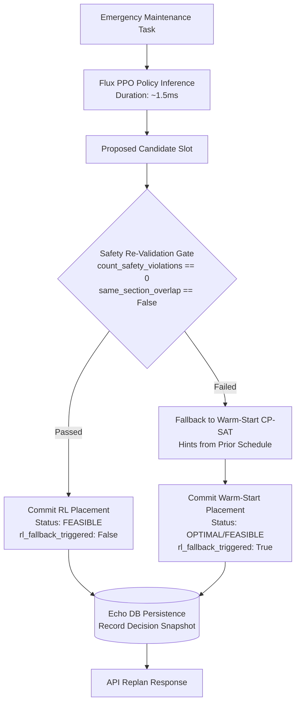

# Cadence System Architecture

Cadence is a safety-first railway maintenance possession block scheduling engine. It plans conflict-free track maintenance windows across complex rail networks using constraint programming (Google OR-Tools CP-SAT) and dynamically re-plans during emergencies using reinforcement learning (PPO) paired with a hard-constraint re-validation gate.

---

## 1. Layered System Architecture

Cadence is structured into nine cleanly decoupled layers:

```text
┌─────────────────────────────────────────────────────────────┐
│                    Presentation Layer                       │
│     Board (React 18 + TypeScript + Vite + Vis-Timeline)     │
└──────────────────────────────▲──────────────────────────────┘
                               │ HTTP / JSON
┌──────────────────────────────▼──────────────────────────────┐
│                         API Layer                           │
│        FastAPI REST API (Routes, Schemas, CORS, Docs)       │
└───────┬──────────────────────┬──────────────────────┬───────┘
        │                      │                      │
┌───────▼──────────────┐┌──────▼──────────────┐┌──────▼───────┐
│  Optimization Layer  ││  Simulation Layer   ││ Explain Layer│
│  Solve (CP-SAT)      ││  Ripple (Cascade)   ││ Reason       │
└───────▲──────────────┘└──────▲──────────────┘└──────▲───────┘
        │                      │                      │
┌───────┴──────────────────────┴──────────────────────┴───────┐
│                 Adaptive Intelligence Layer                 │
│   Flux (Gymnasium Env + PPO Fast-Path + Validation Gate)    │
└──────────────────────────────▲──────────────────────────────┘
                               │
┌──────────────────────────────▼──────────────────────────────┐
│                    Domain & Data Layer                      │
│   Track (NetworkGraph, Models, Profiles, Echo Persistence)  │
└──────────────────────────────▲──────────────────────────────┘
                               │
┌──────────────────────────────▼──────────────────────────────┐
│                     Operations & CI Layer                   │
│      Docker Compose (Postgres, API, Nginx) + GitHub CI      │
└─────────────────────────────────────────────────────────────┘
```

### 1.1 Layer Descriptions

1. **Presentation Layer (`frontend/src/`)**: 
   - Interactive single-page application ("Board") built with React 18, TypeScript, and Vite.
   - Interactive Gantt timeline visualization with visual distinctions for train slots, maintenance blocks, and emergency insertions.
   - Dedicated Explanation Panel (post-hoc counterfactuals from Reason) and Ripple Delay Panel (cascading train delays).
2. **API Layer (`backend/cadence/api/`)**:
   - High-throughput asynchronous REST interface exposing OpenAPI documentation at `/docs`.
   - Manages state hydration, request validation with Pydantic v2 schemas, and run caching.
3. **Optimization Layer (`backend/cadence/solve/`)**:
   - Google OR-Tools CP-SAT integer programming solver.
   - Enforces strict non-overlapping intervals, interval variables, earliest-start/latest-end windows, and safety-adjacency hard constraints.
   - Minimizes soft penalties: task delays (weighted by priority) and train route conflicts (weighted by train disruption penalties).
4. **Simulation Layer (`backend/cadence/ripple/`)**:
   - Deterministic single-hop downstream cascade delay simulator.
   - Models how taking a section out of service pushes back train arrivals across succeeding sections along their route.
5. **Explainability Layer (`backend/cadence/reason/`)**:
   - Independent post-hoc inspection engine.
   - Given a scheduled task, analyzes all alternative candidate time slots across the horizon, evaluating exact reasons for rejection (e.g., train slot conflicts, same-section overlaps, safety-adjacency breaches).
6. **Adaptive Intelligence Layer (`backend/cadence/flux/`)**:
   - Gymnasium-compliant environment (`CadenceReplanEnv`) and Stable-Baselines3 PPO agent.
   - Learns candidate slot selection for sudden emergency task arrivals.
   - Governed by the strict **Re-Validation Gate** (`policy_replan.py`).
7. **Domain Layer (`backend/cadence/domain/` & `backend/cadence/profiles/`)**:
   - Typed data models (`TrackSection`, `TrainSlot`, `MaintenanceTask`, `SectionAdjacency`).
   - Network topology graph built on NetworkX (`NetworkGraph`).
   - Abstract `NetworkProfile` hierarchy (Metro, Local, Mainline).
8. **Persistence Layer (`backend/cadence/echo/` & `backend/cadence/domain/db.py`)**:
   - Relational persistence ("Echo") using SQLAlchemy 2.0 and Alembic migrations.
   - Records every network generation, CP-SAT solve, and replanning decision snapshot.
   - Surfaces chronological run history and warm-start assignment hints.
9. **Operations Layer (`docker-compose.yml`, `Dockerfile`, `.github/workflows/ci.yml`)**:
   - Multi-container orchestration: PostgreSQL 16, FastAPI backend, and Nginx reverse proxy.
   - GitHub Actions CI executing linting, type-checking, 90%+ test coverage enforcement, and Docker smoke testing.

---

## 2. Key Architectural Decisions & Rationale

| Decision | Rationale |
|---|---|
| **CP-SAT for Planned Solves** | Rail operations require mathematical guarantees. Heuristic or search-based methods can violate hard possession boundaries. CP-SAT provides provable optimality and handles complex combinatorial interval constraints natively. |
| **PPO Fast-Path for Emergencies** | In production operations, dispatchers cannot wait minutes for a fresh solver run while an emergency possession is pending. PPO neural forward pass executes in < 2ms, proposing immediate candidate slots. |
| **Structurally Hard Safety Constraints** | Safety rules are never modeled as soft objective penalty terms. Penalties can be traded away by the solver in exchange for lower delay costs. Safety constraints are enforced as structural CP-SAT boolean constraints and verified by independent verification functions. |
| **Independent Post-Hoc Explainability** | Reason does not rely on opaque solver branch logs or external LLMs. It executes deterministic constraint audits against candidate windows, producing certifiable explanations for dispatchers. |
| **Typed Profile Abstraction as Generalization Seam** | Rather than forking solver logic for different rail modes, Cadence isolates behavioral rules (headway, disruption cost, safety adjacency) into subclassed profiles, allowing new network topologies to be added without modifying solver code. |

---

## 3. The Flux Trust Boundary & Emergency Re-planning Flow

A foundational principle of Cadence is that **reinforcement learning policies are never trusted with safety-critical decisions**.

The neural network is treated strictly as an untrusted proposal generator. Its output must pass through an independent, deterministic **Hard-Constraint Re-Validation Gate** before any schedule mutation is committed.

### Emergency Re-plan Decision Flow



### Re-Validation Gate Checks
1. **Module 5 Ground-Truth Safety Adjacency**: Evaluates `count_safety_violations(candidate_blocks, unsafe_adjacency_pairs)`. If the candidate placement violates topological safety invariants defined by the active profile, it is rejected.
2. **Same-Section No-Overlap**: Verifies that no other maintenance possession is active on that track section during the proposed window.

If either check fails:
- The proposal is aborted immediately.
- Execution seamlessly falls back to `replan_warm_start`, using CP-SAT seeded with hints from the previous solve.
- The returned result sets `rl_fallback_triggered = True`, maintaining transparent auditability for rail operators.
